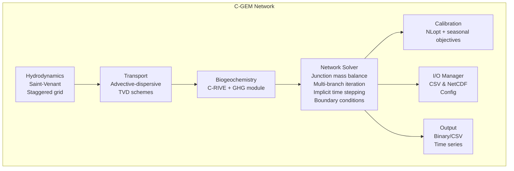

# C-GEM Network

<div align="center">
  <h2>Carbon-Generic Estuary Model for Multi-Branch Networks</h2>
  <p><em>A specialized 1D biogeochemical model for tidal river deltas</em></p>
</div>

---

<div class="grid cards" markdown>

 -  :material-tune:{ .lg .middle } __Introduction__

    ---

    Introduction to C-GEM Network's purpose and capabilities

    [:octicons-arrow-right-24: Learn more](getting-started/introduction.md)

-   :material-water:{ .lg .middle } __Hydrodynamics__

    ---

    Saint-Venant equations on staggered grid with Savenije's estuarine theory

    [:octicons-arrow-right-24: Learn more](physics/hydrodynamics.md)

-   :material-waves:{ .lg .middle } __Transport__

    ---

    TVD advection-dispersion with tidal dispersion and salinity intrusion

    [:octicons-arrow-right-24: Learn more](physics/transport.md)

-   :material-molecule:{ .lg .middle } __Biogeochemistry__

    ---

    C-RIVE module: carbon, nutrients, oxygen, and greenhouse gases

    [:octicons-arrow-right-24: Learn more](physics/biogeochemistry.md)

-   :material-tune:{ .lg .middle } __Calibration__

    ---

    NLopt-powered optimization with seasonal data support

    [:octicons-arrow-right-24: Learn more](user-guide/calibration.md)

</div>

## Why C-GEM?

C-GEM Network fills a critical niche for **rapid, process-based biogeochemical modeling** of complex deltaic networks:

| Feature | C-GEM | 2D/3D Models |
|---------|-------|--------------|
| Setup time | Hours | Days-Weeks |
| Run time (30 days) | Minutes | Hours-Days |
| Network topology | Native support | Requires complex meshing |
| Biogeochemistry | Full C-RIVE | Limited WQ modules |
| GHG emissions | CO₂, CH₄, N₂O | Often missing |
| Calibration | Built-in NLopt | External tools |

[Learn more](user-guide/calibration.md)

## Quick Start

=== "Windows (PowerShell)"

    ```powershell
    # Clone and build
    git clone https://github.com/nguytruonganlab/CGEM_network.git
    cd CGEM_network
    .\scripts\build-and-run.ps1 -r Mekong_Delta_Full

    # Or step-by-step
    .\scripts\build.bat
    .\bin\Debug\CGEM_Network.exe INPUT/Cases/Mekong_Delta_Full/case_config.txt
    ```

=== "Linux/macOS"

    ```bash
    # Clone and build
    git clone https://github.com/nguytruonganlab/CGEM_network.git
    cd CGEM_network
    make
    ./bin/CGEM_Network INPUT/Cases/Mekong_Delta_Full/case_config.txt
    ```

[Learn more](getting-started/quickstart.md) - Quick start guide to run your first simulation

[Learn more](getting-started/installation.md) - Installation instructions for all platforms

## Key Features

-  **Multi-branch network topology** — bifurcations, confluences, distributaries
-  **Computationally efficient** — 1D, runs in seconds to minutes
-  **Complete carbon cycle** — DIC, TA, pH, pCO₂, CO₂ air-water flux
-  **Greenhouse gas emissions** — CO₂, CH₄, N₂O with process attribution
-  **C-RIVE biogeochemistry** — 6-pool organic matter, 2-step nitrification
-  **Automatic calibration** — NLopt integration with seasonal objectives
-  **Open source** — ANSI C, portable, transparent

## Architecture Overview



[Learn more](getting-started/structure.md) - Detailed architecture and source code structure

## Case Studies

<div class="grid cards" markdown>

-   :material-map:{ .lg .middle } __Mekong Delta__

    ---

    4-branch network, seasonal calibration, full biogeochemistry

    [:octicons-arrow-right-24: View case study](cases/mekong-delta.md)

-   :material-map:{ .lg .middle } __Tien River__

    ---

    Single distributary test case for validation

    [:octicons-arrow-right-24: View case study](cases/tien-river.md)

</div>

[Learn more](user-guide/overview.md) - Full user guide and case study of Mekong Delta

## Citation

If you use C-GEM Network, please cite:

```bibtex
@software{cgem_network_2025,
  title = {C-GEM Network: Carbon-Generic Estuary Model for Multi-Branch Networks},
  author = {Nguyen, Truong and CGEM Development Team},
  year = {2025},
  url = {https://github.com/nguytruonganlab/CGEM_network}
}
```

## License

C-GEM Network is released under the [MIT License](about/license.md).
