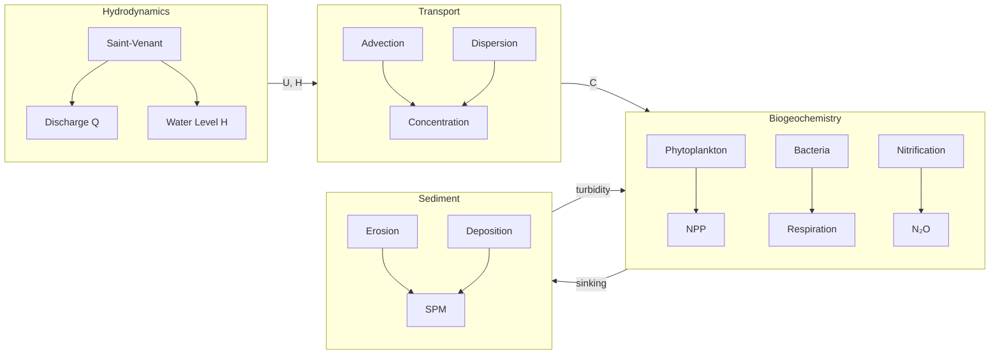
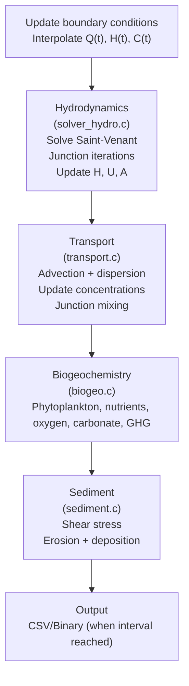
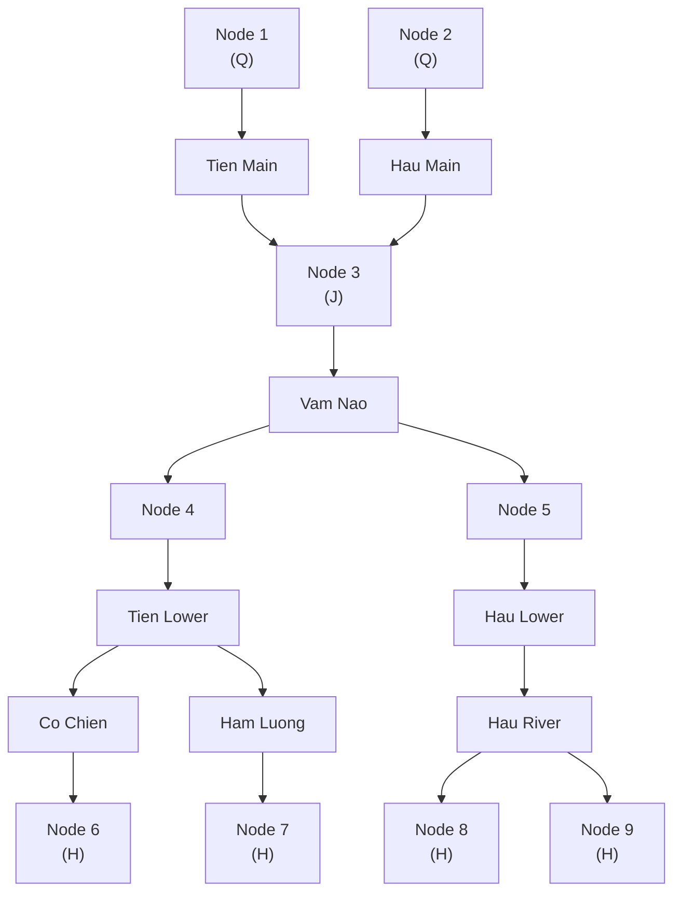

# Model Overview

## Conceptual Framework

C-GEM Network simulates the coupled hydrodynamics and biogeochemistry of tidal river networks through four main modules:

[Learn more](data-preparation.md) - Data preparation and input files

## Time Stepping

Each simulation time step (typically 300 s):

1. **Hydrodynamics**: Solve Saint-Venant equations for H, U
2. **Transport**: Advect-disperse all species
3. **Biogeochemistry**: Update reaction rates, modify concentrations
4. **Sediment**: Erosion/deposition based on shear stress

[Learn more](running.md) - Running simulations and time step control

## Species and Variables

### Hydrodynamic Variables (6)

| Variable | Symbol | Unit | Description |
|----------|--------|------|-------------|
| `depth` | $H$ | m | Water depth |
| `velocity` | $U$ | m/s | Cross-sectional average velocity |
| `waterlevel` | $\zeta$ | m | Water surface elevation |
| `area` | $A$ | m² | Cross-sectional area |
| `width` | $B$ | m | Channel width |
| `dispersion` | $K$ | m²/s | Longitudinal dispersion coefficient |

### Biogeochemical Species (30)

| Index | Name | Symbol | Unit | Description |
|-------|------|--------|------|-------------|
| 0 | `salinity` | SAL | PSU | Conservative tracer |
| 1 | `phy1` | PHY1 | µg C/L | Diatoms (siliceous) |
| 2 | `phy2` | PHY2 | µg C/L | Green algae |
| 3 | `dsi` | DSi | µmol/L | Dissolved silica |
| 4 | `no3` | NO₃ | µmol N/L | Nitrate |
| 5 | `nh4` | NH₄ | µmol N/L | Ammonium |
| 6 | `po4` | PO₄ | µmol P/L | Phosphate |
| 7 | `o2` | O₂ | µmol/L | Dissolved oxygen |
| 8 | `toc` | TOC | µmol C/L | Total organic carbon |
| 9 | `spm` | SPM | mg/L | Suspended particulate matter |
| 10 | `dic` | DIC | µmol/L | Dissolved inorganic carbon |
| 11 | `at` | TA | µmol/L | Total alkalinity |
| 12 | `pco2` | pCO₂ | µatm | Partial pressure CO₂ (diagnostic) |
| 13 | `co2` | CO₂(aq) | µmol/L | Aqueous CO₂ (diagnostic) |
| 14 | `ph` | pH | - | pH (diagnostic) |
| 15 | `hs` | HS⁻ | µmol/L | Sulfide |
| 27 | `no2` | NO₂ | µmol N/L | Nitrite |
| 28 | `n2o` | N₂O | nmol N/L | Nitrous oxide |
| 29 | `ch4` | CH₄ | µmol C/L | Methane |

### Reaction Rates (35+)

| Index | Name | Description | Unit |
|-------|------|-------------|------|
| 0-2 | `npp_no3` | NPP using NO₃ | µmol C/L/d |
| 3-5 | `npp_nh4` | NPP using NH₄ | µmol C/L/d |
| 6-7 | `gpp` | Gross primary production | µmol C/L/d |
| 8 | `npp` | Net primary production | µmol C/L/d |
| 9-11 | `phy_death` | Phytoplankton mortality | µmol C/L/d |
| 12 | `si_cons` | Silica consumption | µmol/L/d |
| 13 | `aer_deg` | Aerobic degradation | µmol C/L/d |
| 14 | `denit` | Denitrification | µmol N/L/d |
| 15 | `nit` | Nitrification (step 1) | µmol N/L/d |
| 16-17 | `o2_ex` | O₂ air-water exchange | µmol/L/d |
| 18-19 | `co2_ex` | CO₂ air-water exchange | µmol/L/d |
| 40 | `nit2` | Nitratation (step 2) | µmol N/L/d |
| 41-43 | `n2o_*` | N₂O production/exchange | nmol N/L/d |
| 44-48 | `ch4_*` | CH₄ production/exchange | µmol C/L/d |

## Network Topology

C-GEM represents river networks as graphs:

- **Branches**: 1D channels with M grid cells
- **Nodes**: Connection points (junctions, boundaries)
- **Connections**: Each branch connects two nodes

### Node Types

| Type | Description | Boundary Condition |
|------|-------------|-------------------|
| `DISCHARGE_BC` | River inflow | Q = Q(t) from forcing |
| `LEVEL_BC` | Tidal boundary | H = H(t) from forcing |
| `JUNCTION` | Internal node | Mass balance: ΣQ = 0 |

### Example: Mekong Delta

